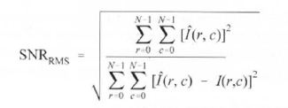

# Question

In practice number 7-1, calculate the SNR(Signal to Noise Ratio) for all those 50, 75 and 90 percent higher frequency signals removed images.

# Answer

First let me define what actually is SNR and what we are expecting here, SNR is a way to compare the strength of a desired signal(in our case, an image) to the background noise of it(in our case, our images after their higher frequencies are removed).

So, if we take a look at the SNR formulation down here, we would understand that if we put the original image and (again) the original image in that formulation, the denominator would be zero and that causes the whole formulation to cause infinity, but as we increase the amount of noise and do the calculation again, we go down from infinity to a smaller, smaller and smaller positive number.

So, we can say that we desire for the higher amount of SNR and the amount of noise is not that much noticeable when SNR is so high up.

So, in conclusion, higher SNR, smaller the noise and smaller SNR, noisier our image.

## Images

### 1. Original

### 2. 50% High Frequency Signals Removed

### 3. 75% High Frequency Signals Removed

### 4. 90% High Frequency Signals Removed

## Conclusion

So, it seems like as we go further and further ahead and remove more higher frequency signals of our image, we are adding more and more amount of noise to the original image because the SNR is getting smaller and smaller.
