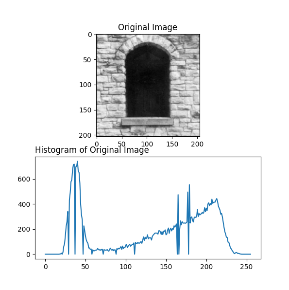
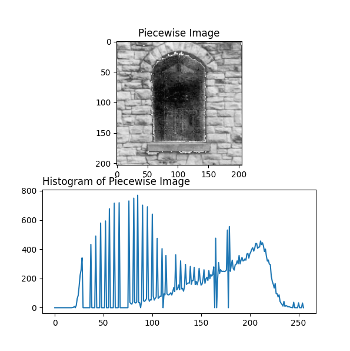
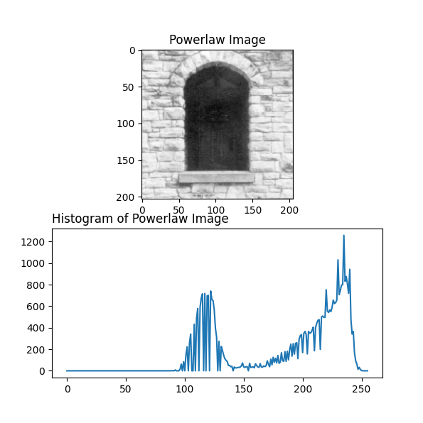

# Question

Why not use `Powerlaw` intensity transformation technique instead of `Piecewise`?

# Answer

First lets have all needed information and charts all together and then decide based on the collected data:

## 1. Original Image:

## 2. Piecewise Image
### Formulation on how to change the gray levels:
1. `x <= 28 || x >= 76 => f(x) = x`
2. `x > 28 && x < 76 => f(x) = (4.829787234 * x) - 107.234042553`

## 3. Powerlaw Image
### Formulation on how to change the gray levels:
`f(x) = (x ^ 0.4) * 27.79227563`

## Analysis

First let's clear this out which the purpose of these changes is to make what is inside the window more clear.

### Comparing Piecewise Image with Original Image

Ok, so the first approach was to do piecewise operation on the original image and if we take a look at the results of the operation, we can actually see the window is more clear now but the new problem is that now we see some odd glitchy colors on the corners of the window which I would say in response if we play with the formulation of the piecewise operation, we can avoid that and make the image more desirable.

With comparing histograms of the piecewise image with the original image, we will see what was expected to happen(gray levels from level 28 to level 76 are now scattered all over the higher gray levels)

### Comparing Powerlaw Image with Original Image

In compare with the original image, we should see that the window of powerlaw image is more desirable that the original image but it is not still completely visible, plus with comparing the histogram charts we see a bin decrease in contrast and the overall view of the image is lighter than before.

### Conclusion

With **Powerlaw** we didn't really achieve the goal, plus we changed contrast of the image which was not necessary. With **Piecewise**, corners are now not desirable we achieved the goal.

So in general, **Powerlaw** can not be the answer to this question and **Piecewise** is more practical.
