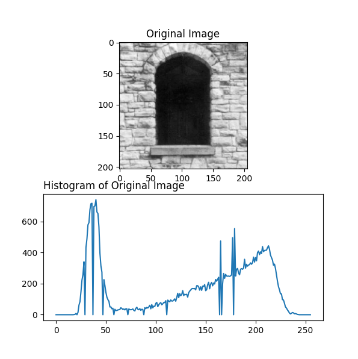
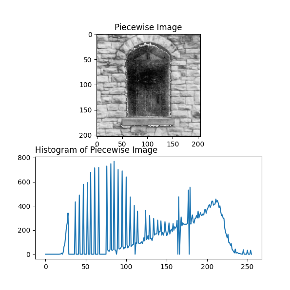
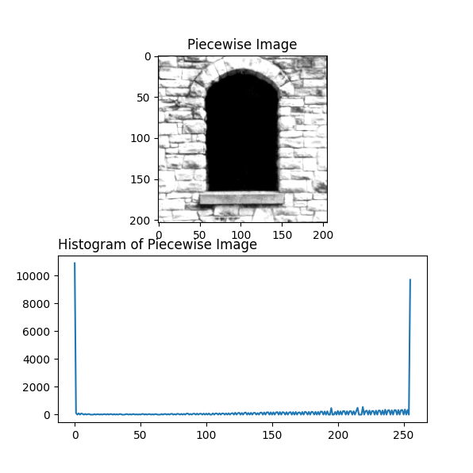

# Question

Why not use this [third piecewise intensity](#3-second-piecewise-image) operation transformation technique instead of the [second piecewise](#2-piecewise-image) operaion?

# Answer

First lets have all needed information and charts all together and then decide based on the collected data:

## 1. Original Image:

## 2. Piecewise Image
### Formulation on how to change the gray levels:
1. `x <= 28 => f(x) = 0`
2. `x >= 76 => f(x) = x`
3. `x > 28 && x < 76 => f(x) = (3.191489362 * x) - 89.361702128`

## 3. Second Piecewise Image
### Formulation on how to change the gray levels:
1. `x <= 50 => f(x) = 0`
2. `x >= 200 => f(x) = 255`
3. `x > 50 && x < 200 => f(x) = (1.7 * x) - 85`

## Analysis

I don't think this needs too much analysis to do because there is nothing visible inside the window in the third piecewise operation, plus white is too white and black is too black and we are almost showing everything in pure black or pure white.

### Conclusion

The second piecewise operation has much better results than the third piecewise operation.
