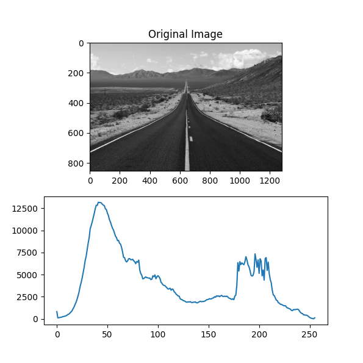
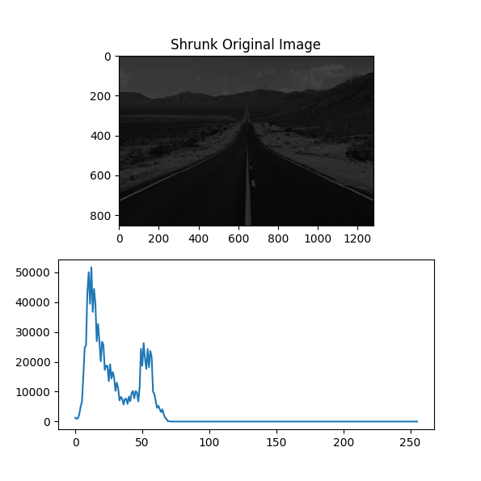
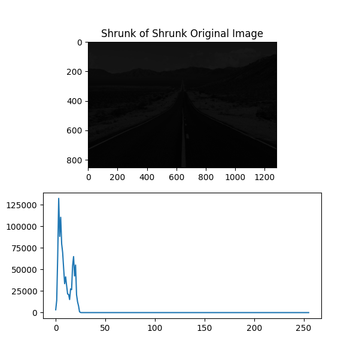
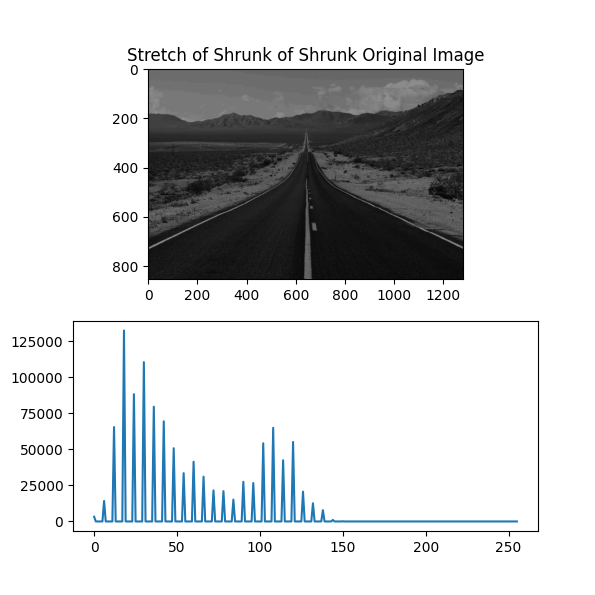
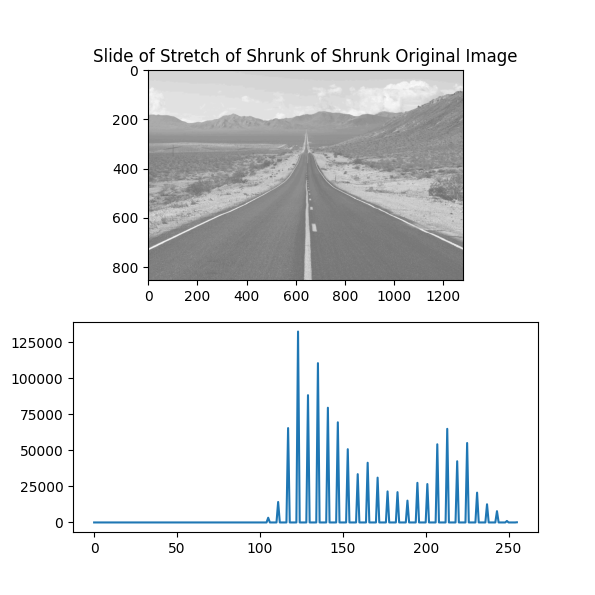
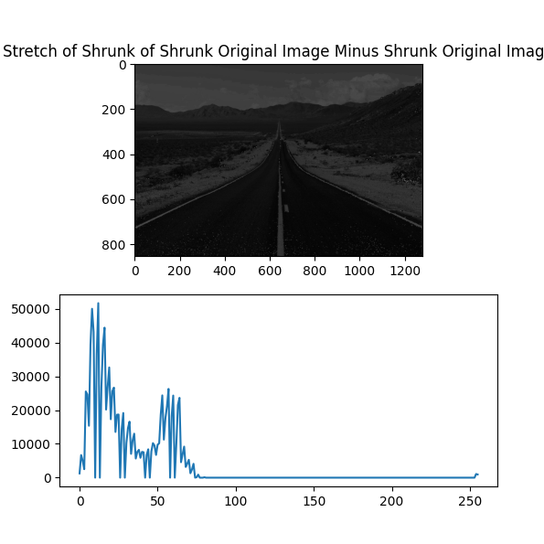
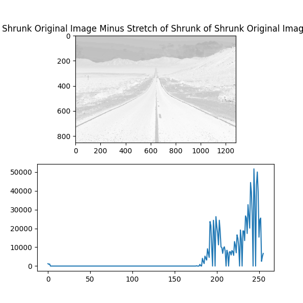
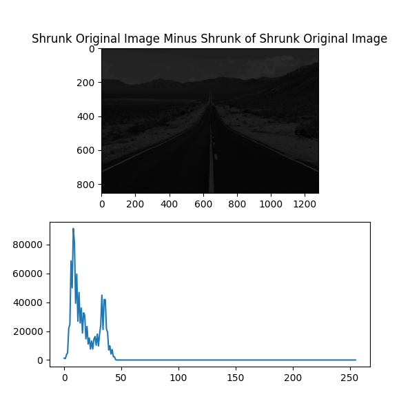

# Question

There is no question, just have a discussion about what is happening and why.

# Analysis

Let's have all needed information and charts all together:

## 1. Original Image:

## 2. Shrunk Original Image:
A shrunk version of the previous image to the range of [0-70].

## 3. Shrunk version of Shrunk Original Image:
A shrunk version of the previous image to the range of [0-25].

## 4. Stretch version of Shrunk version of Shrunk Original Image:
A stretch version of the previous image to the range of [0-150].

## 5. Slided version of the Stretch version of Shrunk version of Shrunk Original Image:
A slided version of the previous image moved just +105 gray value ahead, so the range is now: [105-255].

## 6. Stretch version of Shrunk version of Shrunk Original Image Minus Shrunk Original Image:
A new image which will be a result of this operation: Image number 4 - Image number 2.

## 7. Shrunk Original Image Minus Stretch version of Shrunk version of Shrunk Original Image:
A new image which will be a result of this operation: Image number 2 - Image number 4.

## 8. Shrunk Original Image Minus Shrunk version of Shrunk Original Image:
A new image which will be a result of this operation: Image number 2 - Image number 3.

## Analysis

In Images from 1 to 5 there are so many small changes which are not really huge and not understandable, so let's accept them as a fact and move on.

### Image Number 6

Image number 4 is a stretched image in range of [0-150] and image number 2 is a shrunk image in range of [0-70].

This image is made out of this subtraction: image 4 - image 2

#### How to subtract color values

First let's define what it means to subtract two specific color values:

Let's say we want to know what is the result of this equation: 250 - 255.

With basic math knowledge we can say -5 with ease but in this scenario, -5 doesn't mean anything because we have a specific range of [0-255] and any other number out of these doesn't carry any values. so what we can do, is that we can say which -5 goes around and by goes around, I mean that it starts from 255 and count down from that forward. Let's make sence of this:

250 - 255 = 250 - 250 - 5

What I mean by the second phrase of `250 - 250 - 5` is that we act like we are steping beckwards and think like when we go to negative realms, we start again from 255. So by thin logic, 250-250 is equal to 0 but 0 - 1 is 255. So by this logic, 250 - 255 is equal to 251.

In another way, we can do this:

So we know 250 - 250 is equal to 0. and the result of 250 - 255 is -5.
In this scenario, (when we a have negative value) we can say because we have a range of 256 numbers, we can do a second operation: 256 - 5 which will result in number 251.

With the same logic we can calculate the other way around too, for example: 250 + 10

To calculate this, we can say we come around the other way in this scenario. So in previous example, we came back to start from 255 when the number exceeded to negative number, but now we start from 0. So 250 + 5 is 255 and for the other 5, we start from 0 and count up 4 more times and the result will be 4.

So it is safe to say, after reaching max and beyond: 250 + 10 = 260 we can do: 260 - 256 which is 4.

So when we go negative: 256 + negative number = 256 - number
When we exceed more than 255: positive number - 256 = number - 256

#### Analysis for subtraction of image number 4 from image number 2

So the range of image number 4 is: [0-150]

And the range of image number 2 is: [0-70]

If I want to translate every pixel subtraction to a readable sentence, I would say: value - (less than half of the value) which will always result in a positive value, so for example 10 - 3 is 7, so the image is darker than the image number 4 but brighter than image number 2 and that's exactly what's happening right now.

### Image Number 7

Image number 2 is a shrunk image in range of [0-70] and image number 4 is a stretched of the same image in range of [0-150].

This image is made out of this subtraction: image 2 - image 4

So for this one if I want to do the plain English translation, I would say: value - (a little bit more than two times of the value) which will result in negative values and what we do when we have negative values? we do: (256 - value) and we know which half of the value goes to getting to zero and the other a little bit larger of the image goes to going into the white colors.

Like if we have a pixel with gray value of 10 in image number 2 and let's imagine the same pixel in the image number 4 is 21, the result will be: 10 - 21 = -11 => 256 - 10 = 246.

So it will go reverse and the same happens with white colors too and makes them black.
So we will have a negative image.

But if we zoom in, we will see some black dots in white colors or white dots in black colors.
Why is that?

It is caused because of data loss because of shrinking and then stretching of an image, so it is natural.

### Image Number 8

Image number 2 is a shrunk image in range of [0-70] and image number 3 is a more shrunk of the same image in range of [0-25].

This image is made out of this subtraction: image 2 - image 3

So if I want to translate this subtraction in plain English, I would say: value - (less than one third of the value) which will result in a positive value.

The image will be brighter than image number 3 but darker than image number 2.
