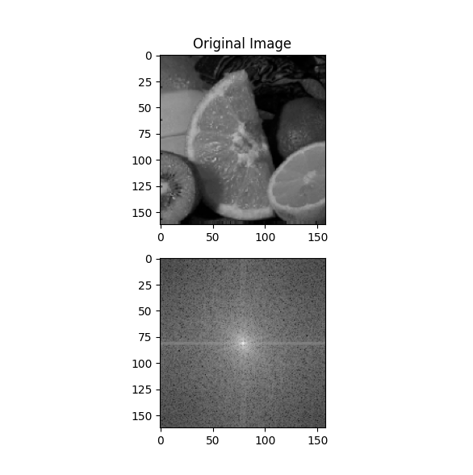
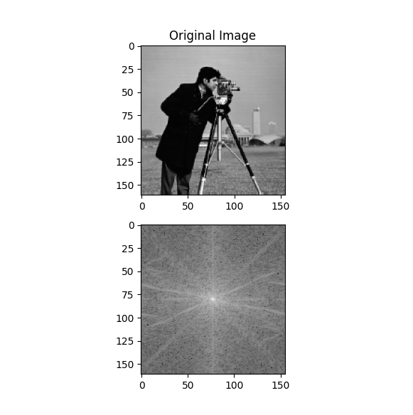
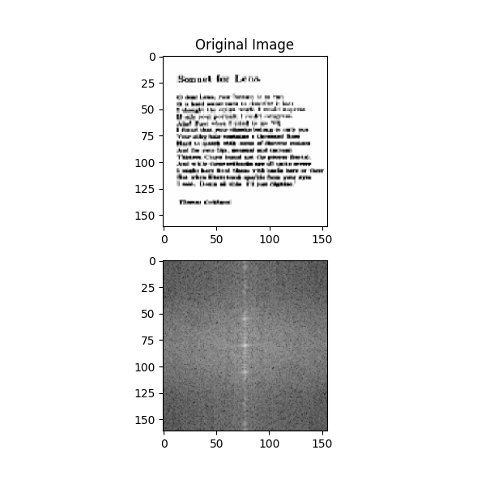
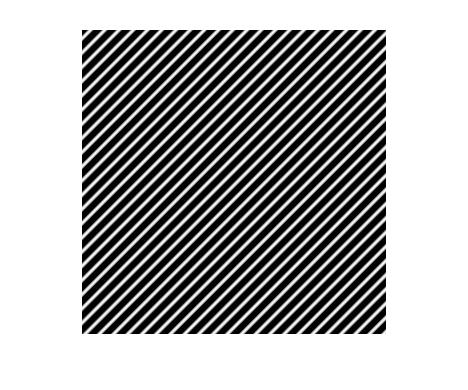
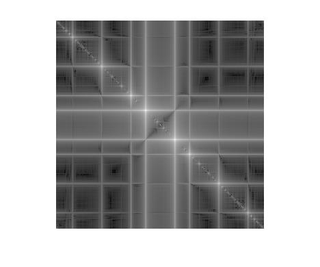
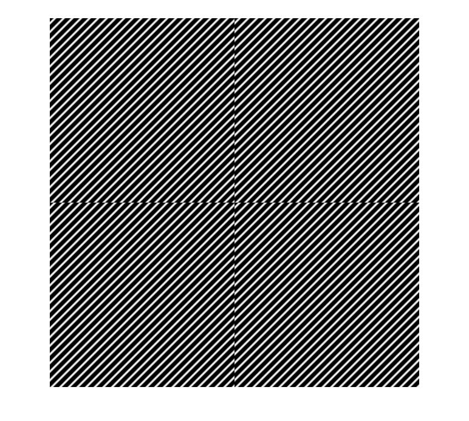

# Question

First calculate the result fourier transform images of these images and then answer why the vertical and horizontal lines exist?

# Analysis

First let's have the three images with their fourier transform result images in place:

### First Image

### Second Image

### Third Image

Let me have this sentence right here:

"Horizontal lines are related to fast vertical changes and vertical lines are related to fast horizontal changes"

What we mean when we say this sentence? Well let's have this question in place to answer that question:

"Why fourier transform of this image look so odd?"

Well this seems like a continuous sinusoidal and in edges there will be no fast changes because it will continue the lines, rights? To test this, let's have four pictures of these side by side:

Oops, it wasn't what we thought it would be. as we see there are fast changes on vertical and horizontal lines.

So, let's wrap it up. If we put 4 pictures of the same pictures side by side, we can have a look at the inner corners and check if fast changes are happening or not and if fast changes are happening in vertical borders, we will predict there would be horizontal lines in the fourier transform result image and if fast changes are happening in horizontal borders, we will predict there would be vertical lines in the fourier transform result image and that would be the reason why vertical and horizontal lines exist in fourier transform image of an image.
