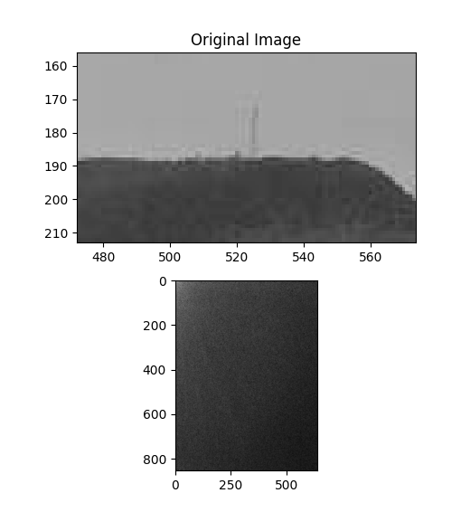
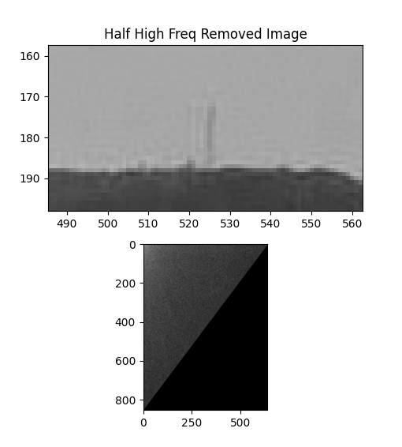
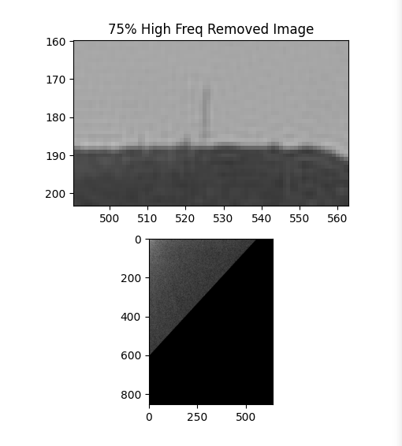
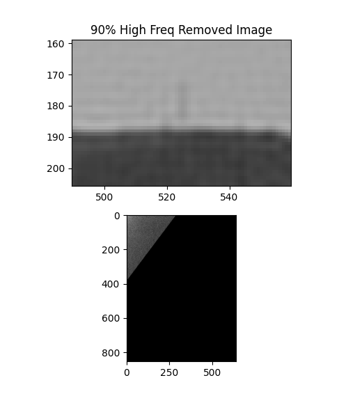

# Question

Analyse when half of image signals on the high frequency side of cosine fourier transform of an image is removed with when 75% is removed and when 90% is removed.

# Analysis

Let's have results first (all images are zoomed at one specific place to see the differences):

## 1. Original

## 2. 50% High Frequency Signals Removed

## 3. 75% High Frequency Signals Removed

## 4. 90% High Frequency Signals Removed

### What are the differences

As we take a general look, maybe there is not a really big difference and it seems like everything is kinda fine but with more percise and deeper look at the images in corners (like the corner in the image results), we can see that it seems like when more high frequencies are removed, the fast shifts from black to white are kinda blending into each other and it seems like we are loosing sharp ends of the image.

And if we just take a more general thinking at the "why" question, it seems obvious, we are removing the high frequency signals so we are loosing the fast changes and so we are loosing the edges of the image.
