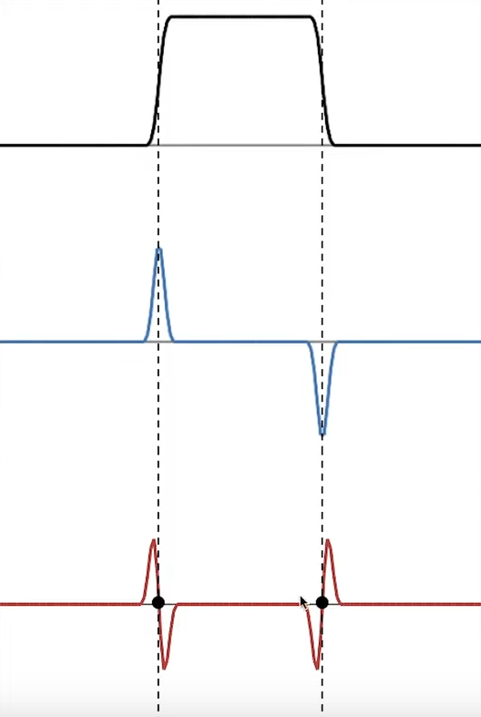
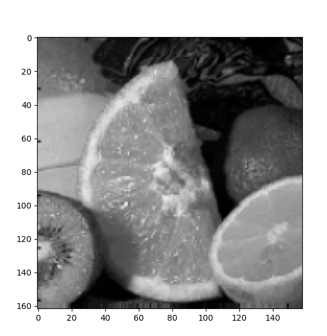
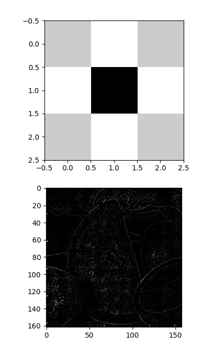

# Question

Talk about Laplacian in spatial domain and frequency domain?

# Answer

First let's talk about the Laplacian.

## What is Laplacian?

Laplacian is the derivative of the gradient of a function or in other words second derivative of a function.

Take a look at the image down here:

As we could expect, f'(x) will go up when f(x) has positive slop and goes down when f(x) has negative slop and goes to 0 when f(x) has a slope of 0 and we can say the same about the f''(x) that f''(x) goes up when f'(x) has positive slope and goes down when f'(x) has negative slop and goes 0 when f'(x) has a slope of 0.

That's it, if we can understand just that line with the previous image, we understood everything.

But let's add some more, so what we can say is that f''(x) will define points which have the greatest number of changes or as we can call them, edges, but can't we say the same thing about the first derivative of the f(x)? Yes f'(x) will define the edges but with high peaks. What distinguishes the second derivative from the first derivative is that it defines the edges with a strong crossing and that can be used to find edges in any other scenarios or functions.

How else we can define Laplacian?

**Laplacian only sees, detects and shows fast changes, or in other words, high frequency changes.**

## Digging Deeper

Now that we know what Laplacian is, now we can start using it.

This is a normal image:

If we apply the Laplacian filter to it, which Laplacian in spatial domain is the first image down here, we get the result of just edges:

# Resources

https://www.youtube.com/watch?v=uNP6ZwQ3r6A&ab_channel=FirstPrinciplesofComputerVision
