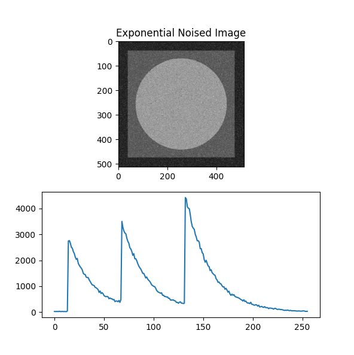
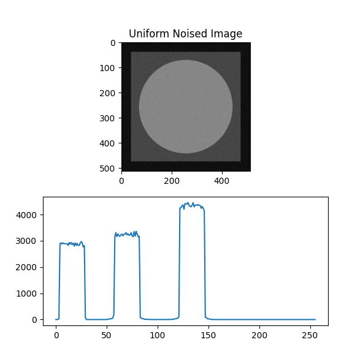

# Question

Apply Gaussian, Exponential, Gamma, Rayleigh, Salt and pepper and Uniform noise on an image.

# Answer

## Gaussian

## Exponential

## Gamma

## Rayleigh

## Salt And Pepper

## Uniform

